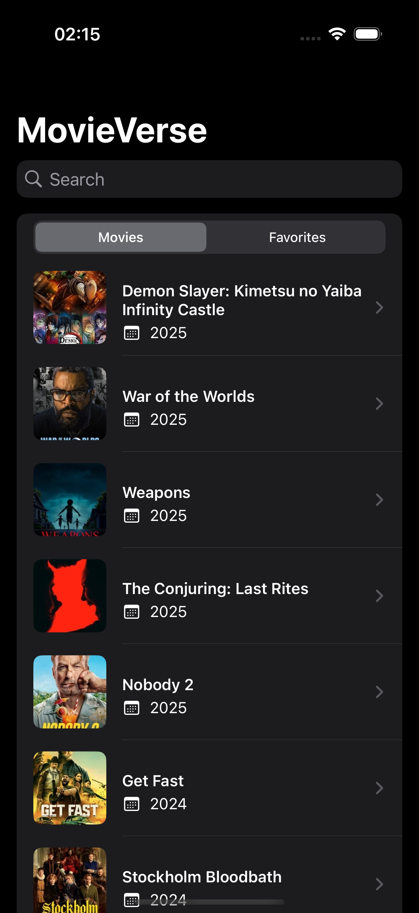
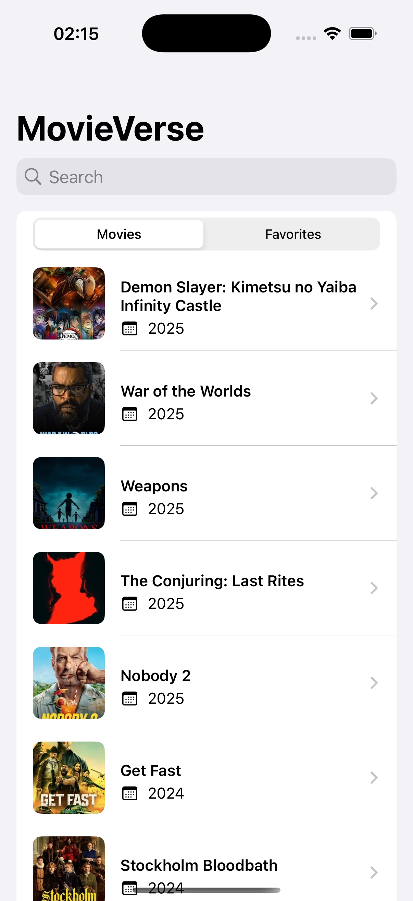
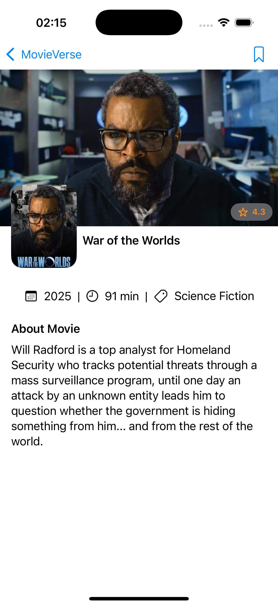

# Movie Search App

This is a simple iOS app that allows users to search for movies, view details, and save favorites.  
It uses [The Movie Database (TMDb)](https://www.themoviedb.org/) API for fetching movie data.

---

## Features

- **Search Movies:** Search by title.
- **Movie Details:** View title, release date, poster image, and overview.
- **Pagination:** Infinite scrolling for large result sets.
- **Favorites:** Save movies to a local favorites list.
- **Offline Support:** Previously fetched data is available offline.
- **Error Handling:** Graceful error messages.
- **Unit & UI Tests:** Included for key functionality.

---

## Screenshots

 



## Requirements

- iOS 15.0+
- Xcode 15+
- Swift 5.9+

---

## Setup Instructions

1. Clone the repository:

   ```bash
   git clone https://github.com/harikrishnabista7/MovieVerse
   cd MovieVerse
   ```

2. Open the project in Xcode:

   ```bash
    open MovieVerse.xcodeproj
   ```

3. Update your_tmdb_bearer_token or your_tmdb_api_key with actual values in Config.xcconfig which is inside the MovieVerse folder
   ```bash
    MOVIE_DB_TOKEN = your_tmdb_bearer_token
    MOVIE_API_KEY = your_tmdb_api_key
    BASE_URL = https://api.themoviedb.org/3/
   ```

Note: You can get an API key and token by creating a free account on [TMDb](https://www.themoviedb.org/).

## Tests

Run tests from Xcode:

```bash
cmd+U
```
